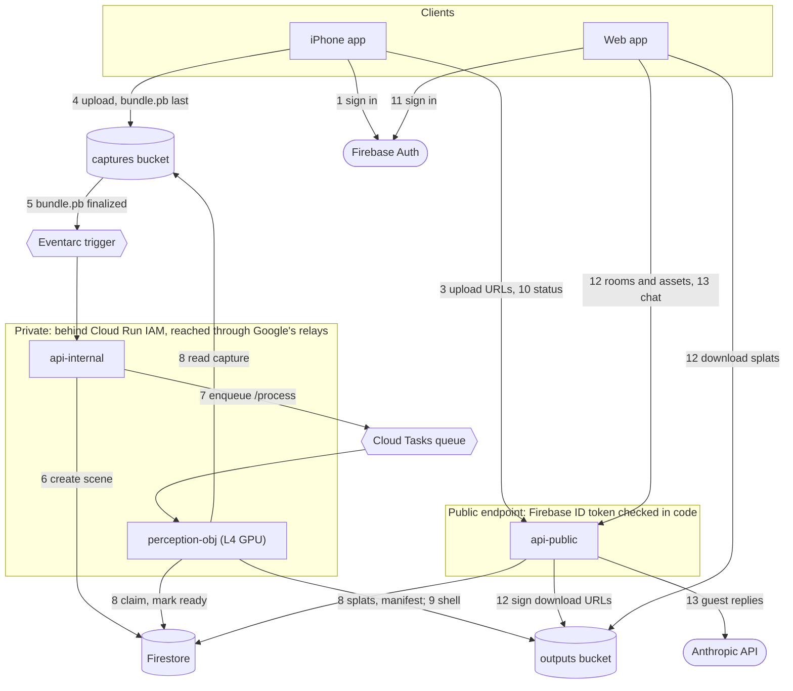
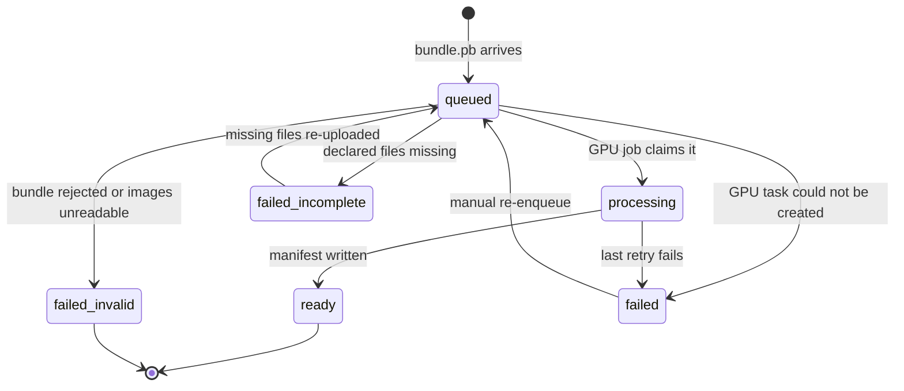

# Architecture

This is the map of The Good Guest for someone new to the code. It explains
what the system does, which parts it is made of, how one room travels through
them, and the rules every part keeps. It names files, modules and symbols so
you can search for them; how any one module works inside is in that module's
own docstring.

It describes the shape of the system, which changes rarely. What is deployed
right now, which revision serves, test counts and open defects change often
and live in [`PROJECT.md`](PROJECT.md). Setup and deploy commands are in
[`README.md`](README.md). The reasons behind decisions are numbered notes in
[`docs/decisions/`](docs/decisions/README.md), cited here like this: (0052).

Last checked against the code on 2026-10-06.

## Contents

1. [The product in one minute](#1-the-product-in-one-minute)
2. [The parts](#2-the-parts)
3. [One room, end to end](#3-one-room-end-to-end)
4. [Contracts and stored data](#4-contracts-and-stored-data)
5. [Inside the GPU service](#5-inside-the-gpu-service)
6. [Inside the conversation](#6-inside-the-conversation)
7. [Rules that hold everywhere](#7-rules-that-hold-everywhere)
8. [Cross-cutting concerns](#8-cross-cutting-concerns)
9. [Code map](#9-code-map)
10. [Where to start](#10-where-to-start)
11. [Glossary](#11-glossary)

## 1. The product in one minute

Someone with a LiDAR-equipped iPhone walks slowly around a room while the app
records it. Once the upload has been processed, the same room opens in a web
browser as a 3D model they can turn around, and they can talk about it with
*the guest*: a
conversational AI that answers from the room's measurements and can propose
moving, removing or turning a piece of furniture.

The 3D room is the medium, not the product. The product is helping someone
decide how to improve their room. The framing is in `PROJECT.md` under "What
we're building", and the founding vision is `docs/product/initial-idea-draft.md`.

Four stages make that happen, each in its own part of the repository:

| Stage | What happens | Where |
|---|---|---|
| Scan | The app records photos, LiDAR depth, where the phone was for every photo, and Apple's outline of the room. | `ios/TheGoodGuest/` |
| Send | The app uploads a *capture bundle*: one small index file, `bundle.pb`, plus the images it points to. | `packages/schemas/capture_bundle.proto` |
| Rebuild | A GPU service finds each piece of furniture, rebuilds it in 3D, and places it where it stands in the measured room. | `services/perception-obj/` |
| Visit and talk | The web app shows the rebuilt room and hosts the conversation. | `web/`, `services/api-public/` |

The iPhone app only captures; it has no 3D viewer. Everything after the
upload happens on the web.

## 2. The parts

Everything runs on Google Cloud, in the project `thegoodguest`, region
`asia-southeast1`. The numbers on the arrows are the steps in
[section 3](#3-one-room-end-to-end).



| Part | Kind | In the repo | Its job |
|---|---|---|---|
| iPhone app | ours; Swift, ARKit, RoomPlan | `ios/TheGoodGuest/` | Guides the scan, builds the capture bundle, uploads it in the background, and follows the room's status. LiDAR devices only. |
| Web app | ours; Next.js static export, three.js, Spark | `web/` | Lists your rooms, renders them in 3D, hosts the conversation. Static files on Firebase Hosting, with no server of its own. |
| `api-public` | ours; FastAPI on Cloud Run, public | `services/api-public/` | The only API the two apps call: upload URLs, room lists and assets, the conversation, the design spec, account deletion. |
| `api-internal` | ours; FastAPI on Cloud Run, private | `services/api-internal/` | Receives the "upload finished" event, validates the bundle, creates the scene, queues the GPU job. |
| `perception-obj` | ours; FastAPI on Cloud Run with one NVIDIA L4 GPU, private | `services/perception-obj/` | Finds, rebuilds and places every object; builds the room's walls and floor; compresses the 3D files. |
| captures bucket | Cloud Storage, `thegoodguest-captures` | none | Raw uploads from the phone, kept only briefly. |
| outputs bucket | Cloud Storage, `thegoodguest-perception-outputs` | none | Everything perception produces: splats, manifests, shells. |
| Firestore | Google's document database | `packages/api-core/` and each service's repository modules | Scenes, upload sessions, quotas, conversations, design specs. |
| Eventarc trigger | Google relay, `captures-bundle-pb-finalized` | `infra/eventarc_setup.sh` | Turns "a file finished uploading" into a request to `api-internal`. |
| Cloud Tasks queue | Google relay, `perception-dispatch` | `infra/cloud-tasks-queue.md` | Delivers GPU jobs with a signed identity token, and retries failures. |
| Firebase Auth | Google | none | Sign-in. Anonymous at first, later linked to Apple or Google. |
| Firebase Cloud Messaging | Google | `fcm.py` in both pipeline services | Optional push to the phone when an upload is incomplete or a room finishes. Only fires if the upload session carried a device token; the app learns status by polling. |
| Anthropic API | outside service | none | The language model behind the guest's replies, and the vision call that names each wall's and floor's material. |

Three choices explain most of this shape:

- **Large files never pass through our services.** The phone uploads straight
  into Cloud Storage with resumable upload URLs that `api-public` mints, and
  the browser downloads 3D files straight from Cloud Storage with signed URLs
  that `api-public` signs.
- **Nothing calls the GPU directly.** A finished upload raises an event, and
  work reaches `perception-obj` only through Eventarc and Cloud Tasks, which
  retry when something fails (0003). The GPU service scales to zero when idle,
  so no GPU runs between rooms; the first job after a quiet spell waits for
  a cold start.
- **The two APIs are split on the trust boundary (0016).** A Cloud Run
  service either checks Google-issued identity tokens at the platform, before
  any of our code runs, or lets every request through to code that checks
  Firebase ID tokens itself. It cannot do both. So the event and task
  receivers sit behind the platform check, and `api-public`, the one thing
  the apps call, verifies Firebase tokens in code.

## 3. One room, end to end

Phone paths below are relative to `ios/TheGoodGuest/TheGoodGuest/`, and each
backend file sits in the service the step names.

### Capture, on the phone

1. **Sign in.** On first launch the app signs in to Firebase Auth
   anonymously. Linking Apple or Google later keeps the same user id (0051,
   0118). `Auth/AuthManager.swift`.
2. **Scan.** ARKit tracks where the phone is. The app keeps a keyframe each
   time the phone moves 10 cm or turns 5°, with its pose, camera intrinsics
   and LiDAR depth. RoomPlan runs on the same AR session and outlines the
   walls, doors, windows and a box around each piece of furniture (0077,
   0079). `Capture/CaptureManager.swift`, `Capture/KeyframeAccumulator.swift`,
   `Capture/BundleAssembler.swift`.
3. **Ask for upload URLs.** The app sends the list of files it is about to
   upload to `POST /captures/{bundle_id}/upload_session`. `api-public` checks
   the caller's daily limits, claims the bundle id for that user, validates
   the file list, records the session in Firestore, and returns one resumable
   upload URL per file. `upload_session_repo.py` and `manifest_validation.py`
   in `packages/api-core/`.
4. **Upload.** A background `URLSession` puts each file straight into the
   captures bucket under `captures/{bundle_id}/`, and keeps going if the app
   is closed. `bundle.pb` goes last, once every other file has landed (0040).
   `Upload/UploadCoordinator.swift`, `Upload/BlobUploadManager.swift`.

### Rebuild, in the cloud

5. **The upload starts the pipeline.** When `bundle.pb` finishes writing,
   Cloud Storage raises an event and the Eventarc trigger turns it into
   `POST /ingest/eventarc` on `api-internal`. Events for the other files
   arrive too and are ignored. `services/api-internal/ingest_server.py`.
6. **Check the bundle, then create the scene.** `api-internal` checks the
   schema version, that the bundle id matches the path, that a device id is
   present, that every file the bundle names exists, and that the images
   decode, all before any GPU time is spent. It writes a *scene* record to
   Firestore with status `queued`, then moves it to `failed_incomplete` or
   `failed_invalid` if a check failed. The scene's owner is copied from the
   upload session, which `api-public` wrote under a verified token, never
   from the bundle's own `user_id`. `validation.py`, `blob_validator.py`,
   `repository.py`.
7. **Queue the GPU job.** `api-internal` puts a task on `perception-dispatch`.
   Cloud Tasks calls `POST /process` on `perception-obj`, signed as the
   `tasks-invoker` service account, and retries if the call fails.
   `dispatcher.py`.
8. **Rebuild the room.** `perception-obj` claims the scene (`processing`),
   reads the bundle and its images, and runs the pipeline in
   [section 5](#5-inside-the-gpu-service). It writes the splats and
   `scenes/{scene_id}/manifest.json` to the outputs bucket and marks the
   scene `ready`. If the last retry fails, it marks it `failed`.
   `process_receiver.py`, `receiver_repo.py`.
9. **Finish the room.** On success, `/process` queues two follow-up tasks:
   `/shell` builds the walls and floor (`shell.json`), and `/compress` writes
   a compressed `.spz` copy beside every `.ply` splat (`compressed.json`).
   `shell_enqueue.py`, `compress_enqueue.py`.

### Results, on the phone and the web

10. **The phone hears back.** The app polls `GET /scenes/by-bundle/{bundle_id}`
    and shows progress in a Live Activity on the Lock Screen. When the room is
    ready it offers a link to `/room?bundle={bundle_id}` on the web app.
    `Scene/ScenePoller.swift`, `LiveActivity/`.
11. **Sign in on the web.** The web app signs in to the same Firebase account
    through Apple or Google. An account that was never linked stays anonymous
    and cannot be opened from a browser, so the phone offers the link only
    when it would land. `web/src/lib/firebase.ts`.
12. **Load the room.** The web app asks `api-public` for the caller's rooms
    (`GET /scenes`), finds the scene for a bundle
    (`GET /scenes/by-bundle/{bundle_id}`), then fetches its assets
    (`GET /scenes/{scene_id}/assets`): the manifest and shell, plus
    short-lived signed URLs for every splat. The browser downloads the
    splats straight from the outputs bucket, preferring `.spz`, and plays the
    reveal. `web/src/lib/api/client.ts`, `assembleScene` in
    `web/src/lib/api/types.ts`, `web/src/components/SplatViewer.tsx`.
13. **Talk with the guest.** A message goes to
    `POST /scenes/{scene_id}/conversation/messages`, and the reply streams
    back as server-sent events. A requested change comes back as a proposal
    that has already been checked against the measured room
    ([section 6](#6-inside-the-conversation)).

## 4. Contracts and stored data

### The capture bundle

`packages/schemas/capture_bundle.proto` is the only contract between the phone
and the backend. Swift and Python bindings are generated from it by
`tools/gen_proto.sh`, and both are committed:
`ios/TheGoodGuest/TheGoodGuest/Generated/capture_bundle.pb.swift` and
`packages/schemas/thegoodguest_schemas/capture_bundle_pb2.py`. The file's header
comment explains the frame and pose conventions; read it before changing
anything that crosses this boundary.

- `CaptureBundle`: `schema_version`, `bundle_id`, `user_id`, the `Device`,
  the `CaptureTier`, timestamps, the `frames`, ARKit's `plane_anchors`, and
  an optional `room_plan`.
- `Frame`: one keyframe, with the path of its photo (`rgb_gcs_path`), the
  camera's `Pose`, its `Intrinsics`, `Gravity`, and an optional `Depth` that
  names a depth map and its confidence map.
- `PlaneAnchor`: a flat surface ARKit measured, such as the floor or a wall.
- `RoomPlanModel`: the path of RoomPlan's own `room.json`, shipped verbatim.
- `CaptureTier`: `ARKIT_ONLY`, `LIDAR_ARKIT` or `LIDAR_ROOMPLAN`. It records
  what evidence the capture carries, and the backend degrades by tier when
  some is missing.

Pixel data is never inside the bundle. The bundle names each file by a path
relative to its own folder, so `bundle.pb` stays small.

### Where data lives

| Store | Layout | Written by | Read by |
|---|---|---|---|
| captures bucket | `captures/{bundle_id}/bundle.pb` and the files it names | the phone, through upload URLs | `api-internal`, `perception-obj` |
| outputs bucket | `scenes/{scene_id}/manifest.json`, `shell.json`, `compressed.json`, and per-frame masks and splats under `frames/` | `perception-obj` | `api-public`; the browser, through signed URLs |
| Firestore `scenes` | one document per capture | `api-internal`, `perception-obj` | all three services |
| Firestore `upload_sessions`, `upload_mint_quotas` | one session per bundle; one quota document per user, reset each UTC day | `api-public` | `api-public`, `api-internal` |
| Firestore `conversations` (with `turns` inside), `design_specs` | one per scene and user | `api-public` | `api-public` |

A bucket lifecycle rule deletes captures about a day after upload, so a room's
outputs are its durable copy; a capture that matters must be copied off the
same day. Failed scenes expire through a Firestore TTL policy. Both are set by
`infra/eventarc_setup.sh` (0086).

### A scene's status

A scene's `status` field is the room's public state: the phone polls it, and
the web lists it. Only `api-internal` and `perception-obj` change it, and only
along the moves allowed by `_ALLOWED_TRANSITIONS` in
`packages/api-core/thegoodguest_api_core/scene.py`.



`ready` and `failed_invalid` are final. A `failed_incomplete` scene recovers
when the phone re-uploads the missing files, because the new `bundle.pb` fires
the trigger again. A `failed` scene goes back to `queued` only by hand, with
`tools/reenqueue_scene.py`.

### The manifest

`manifest.json` lists every object in a room. Each entry either says where the
object stands or says why it could not be placed:

```json
{
  "object_id": "obj_004",
  "label": "armchair",
  "placed": true,
  "method": "roomplan_box",
  "splat_gcs_uri": "gs://thegoodguest-perception-outputs/scenes/<scene_id>/frames/0012/splats/03_armchair.ply",
  "world_transform": {
    "position": [1.42, 0.41, -2.10],
    "rotation_xyzw": [0.0, 0.3827, 0.0, 0.9239],
    "scale": 0.87
  }
}
```

```json
{ "object_id": "obj_009", "label": "plant", "placed": false, "reason": "no_scale_reference",
  "splat_gcs_uri": null, "world_transform": null }
```

The values are illustrative and the field names are real. Positions are meters
in the room's frame, and the rotation is a quaternion: this one is a 45° turn
about the vertical axis. `method` says which evidence placed the object. The
reader-side types, including every `method`, are `FusedObject` and
`WorldTransform` in `web/src/lib/api/types.ts`.

### The HTTP surface

`api-public`, all in `services/api-public/public_server.py`:

| Route | Called by | Purpose |
|---|---|---|
| `POST /captures/{bundle_id}/upload_session` | phone | Mint resumable upload URLs for one capture. |
| `GET /scenes` | phone, web | The caller's rooms. |
| `GET /scenes/by-bundle/{bundle_id}` | phone, web | One capture's scene and status. |
| `GET /scenes/{scene_id}/assets` | web | Manifest, shell and signed URLs for the room's 3D files. |
| `GET /scenes/{scene_id}/conversation` | web | The conversation so far. |
| `POST /scenes/{scene_id}/conversation/messages` | web | One turn with the guest, streamed as server-sent events. |
| `GET` and `DELETE /scenes/{scene_id}/design_spec` | web | The current arrangement proposal; put the whole room back as measured. |
| `DELETE /account` | phone, web | Erase the caller's account and everything in it (0095). |

`api-internal` serves only `POST /ingest/eventarc`. `perception-obj` serves the
three pipeline stages `POST /process`, `/shell` and `/compress`, and two
operator probes, `/segment` and `/track`, that nothing in the pipeline calls.
Every service also answers `GET /health`; `perception-obj`'s `GET /ready`
reports whether its models are loaded.

## 5. Inside the GPU service

`perception-obj` rebuilds the room. It runs on one NVIDIA L4 GPU, loads its
models when the first job arrives, and scales to zero when idle. Every scene
goes through `/process`, then `/shell` and `/compress`.

`/process`, orchestrated by `process_receiver.py`:

1. **Choose frames.** Running the models on every keyframe would be too slow,
   so the service picks a set of frames that together see every RoomPlan
   box, plus extra frames from varied viewpoints (`census_sampling.py`;
   `sampling.py` when there are no boxes).
2. **Find objects.** SAM 3 outlines every match for a fixed list of furniture
   names in each chosen frame (`DEFAULT_OBJECT_PROMPT`, `models/sam3.py`).
   `mask_refine.py` repairs a mask that the frame's own LiDAR shows was cut
   short. People are found only so they can be removed (`privacy.py`, 0089).
3. **Rebuild each object.** SAM 3D Objects turns one photo plus one mask into
   a Gaussian splat of that object (`models/sam3d.py`). The best views go
   first, inside a per-request time budget (`budget.py`).
4. **Place it in the room.** Each object is placed by the strongest evidence
   it has: the box RoomPlan measured for it (`box_placement.py`, 0077),
   contact with a measured floor or wall (`contact_priors.py`), a fit across
   several views, or LiDAR depth (`placement.py`, `reproject.py`). Clean-up
   passes then remove duplicates and snap pieces to walls and surfaces. An
   object with no usable evidence ships as `placed: false` with a reason.
5. **Merge sightings.** The same chair seen in five frames becomes one entry
   with the splat from its best view (`fusion.py`). The result is
   `manifest.json`.

`/shell` (`shell_receiver.py`) builds the walls and floor. It uses RoomPlan's
geometry when the capture has it (`roomplan_room.py`) and otherwise ARKit's
measured planes (`room_planes.py`, `shell_envelope.py`, `shell_geometry.py`).
Colour comes from the capture's own pixels (`shell_observation.py`). The
material family (wood, tile, carpet, painted and so on) comes from one
vision-model call per surface (`shell_material.py`); when the model is not
confident, or the call fails, the surface stays a plain matte in its
measured colour.

`/compress` (`compress_receiver.py`) writes a `.spz` copy of every `.ply`
splat (0125).

`/segment` and `/track` let engineers ask what SAM 3, or SAM 3.1's video
tracker, sees in a capture (`segment_receiver.py`, `track_receiver.py`,
`models/sam3_video.py`, 0274). They write only under their own probe folders
and never touch Firestore, so a probe cannot change a room anyone can see.

Two things to read before changing anything here. "Measured dead ends" in
`PROJECT.md` lists perception approaches that were tried and measured not to
work; each one cost GPU time to learn. And `services/perception-obj/upstream/`
holds verbatim copies of the SAM 3 and SAM 3D entry points the service's
wrappers call, pinned to the commits the image is built from. They, not the
wrappers, are the authority on what those models do (0264).

## 6. Inside the conversation

The guest is a language model called from `api-public`. The work is split by
what each side can know: the model handles language, and ordinary code
handles geometry. Coordinates never go into the prompt, and the model has no
way to send any back (0132).

One turn, when the person asks for a change:

1. The browser posts the message to
   `POST /scenes/{scene_id}/conversation/messages`.
2. `scene_facts.py` derives facts from the manifest and phrases them as
   finished sentences, such as a distance already put into words; the raw
   manifest never enters the prompt. `guest_prompt.py` assembles the prompt,
   and the guest's whole contract is versioned in code.
3. The model's reply streams to the browser as server-sent events. The turn
   is saved (`conversation_repo.py`) even if the browser disconnects partway.
4. To change the room, the model calls the `propose` tool with words alone:
   which object, whether to `move`, `remove` or `turn` it, and where it should
   go relative to something else. `revert` puts pieces back where they were
   measured. Neither tool has a numeric field (`guest_tools.py`).
5. `spec_solver.py` turns that intent into a placement in the measured room,
   built from the manifest and shell by `room_geometry.py`. It checks that
   the piece's whole footprint stays inside the measured floor, overlaps no
   other piece, and keeps its height, or it refuses with a reason such as
   `no_clear_space`.
6. The accepted proposal is stored in the design spec (`design_spec.py`),
   where every `proposed_transform` sits beside the `measured_transform` it
   departs from. The web app draws the new arrangement over the room
   (`web/src/lib/designSpec.ts`) without downloading the room again.

The model is chosen by the `GUEST_MODEL` setting in
`infra/api-public.env.yaml`, and its API key comes from Secret Manager.
`services/api-public/tests/test_guest_voice_evals.py` checks the guest's voice
when the model or prompt changes.

## 7. Rules that hold everywhere

These are the system's invariants. Code that breaks one is wrong even if its
tests pass.

1. **One coordinate frame, end to end.** Everything uses ARKit's world frame:
   right-handed, +Y up, meters. A pose is a position plus a unit quaternion
   `(x, y, z, w)`, not a 4×4 matrix. The phone never converts; the backend
   converts only where a model needs its own frame (0052). Quaternion math
   lives only in `pose_math.py`, and placement geometry only in
   `placement_math.py`, both in `packages/schemas/thegoodguest_schemas/`.
2. **Identity comes from verified tokens, never from payloads.** `api-public`
   verifies a Firebase ID token on every user request (`auth.py`) and scopes
   every query to that user. A scene's owner comes from the upload session,
   never from the `user_id` inside the bundle.
3. **The private services sit behind Cloud Run IAM.** Neither `api-internal`
   nor `perception-obj` accepts an unauthenticated request. On `api-internal`
   the invoker role goes to the Eventarc trigger's service account
   (`infra/eventarc_setup.sh`). On `perception-obj` only `tasks-invoker`
   holds it (0106), and `oidc.py` also checks that each token names that
   account and was minted for the exact route it arrives at. Each service
   runs as its own service account, and `perception-obj`'s is least-privilege
   by design (0090).
4. **Check before spending GPU time.** Bad bundles stop in `api-internal`. A
   rejection is recorded on the scene and answered with HTTP 200, so the
   phone can see why and Eventarc does not redeliver the event forever.
5. **Never guess.** Missing evidence is reported, not filled in. An object
   without a placement ships `placed: false` with a reason, the solver
   refuses rather than inventing a spot, and screens show elapsed time
   rather than an invented ETA.
6. **The guest never handles coordinates.** Geometry belongs to the solver
   ([section 6](#6-inside-the-conversation)).
7. **People are never rebuilt.** `person` is segmented only so it can be
   suppressed. It is never reconstructed or shipped (0089).
8. **Status moves only along `scene.py`'s transitions**, written only by
   `api-internal` and `perception-obj`.
9. **One web module talks to the renderer.** `SplatViewer.tsx` is the only
   file that imports three.js or Spark (0053), and it takes a
   renderer-agnostic list of positioned splats.

## 8. Cross-cutting concerns

**Identity and accounts.** Every account starts anonymous on the phone and
is upgraded in place by linking Apple or Google, which keeps the user id and
therefore every room. Deleting an account removes its files, then its
Firestore records, then the identity itself, and is safe to re-run (0095).
Never enable anonymous-user auto-cleanup in Firebase Auth: it would silently
orphan every user's rooms (0139).

**Cost limits.** Every service scales to zero. `api-public` enforces per-user
daily limits on captures and on upload-URL mints, caps the size of an upload,
and limits guest turns per conversation per day. `perception-obj` gives each
request a time budget. The knobs are environment variables, listed with their
reasons in `infra/api-public.env.yaml` and `infra/api-internal.env.yaml`.

**Configuration.** Each service reads environment variables set at deploy
time from `infra/*.env.yaml` and Secret Manager (`infra/secrets.md`). In
production, the two APIs refuse to start if a required variable is missing
(`_PRODUCTION_REQUIRED_VARS`). Optional perception behaviours are
`PERCEPTION_*` switches, so one image can run with a pass on or off.

**Privacy and retention.** People are suppressed (rule 7). Captures are
deleted about a day after upload, failed scenes expire, and per-frame mask
intermediates expire after 180 days (`infra/eventarc_setup.sh`, 0086).
`DELETE /account` reaches every per-user collection and storage prefix.

**Deploys.** Every service deploys as candidate, smoke, flip: the new
revision starts with no traffic, passes a smoke test, and only then takes
traffic. Images are built by Cloud Build (`infra/cloudbuild/`). Because a
scale-to-zero GPU service boots from whatever image it is pinned to, the live
`perception-obj` image is protected in the registry by a `serving` tag that
`infra/deploy_perception.sh` moves at the flip (0200). The web app deploys to
Firebase Hosting from `web/`. The procedure is `infra/RUNBOOK.md`.

**Testing.** The Python suites must pass with no cloud credentials; a test
that needs them is a bug in the test. The root suite (`pytest`) covers the
packages, both APIs and some tools. `perception-obj` has its own suite, run
separately because it pins `numpy<2`. The web app has vitest, lint, type
check and build. The iOS project has one scheme, whose suite includes live
tests against the deployed `api-public`. CI is in `.github/workflows/`:
Python and web run on push, iOS only on demand, and nothing gates on it.
Commands and policies are in `README.md` and `PROJECT.md`.

**Documentation.** `PROJECT.md` is the current state of each part.
`docs/decisions/` holds one numbered note per decision. `docs/punchlist.md`
is the remaining work, and `tools/punchlist_check.py` re-checks it against
the live system. Every long-lived source file opens with a docstring saying
what it is for and who reads it.

## 9. Code map

Where to find the thing that does X. Names are given so you can search for
them.

### `packages/` — libraries installed into the services' images

They never run on their own.

- `schemas/capture_bundle.proto` — the phone-to-backend contract.
- `schemas/thegoodguest_schemas/` — the generated `capture_bundle_pb2.py`,
  `pose_math.py` (every quaternion operation) and `placement_math.py` (depth
  backprojection, single-view fits, ray triangulation, floor and wall
  contact).
- `api-core/thegoodguest_api_core/` — what both APIs share: `scene.py` (the
  `Scene` model, `SceneStatus` and its transitions), `scene_read_repo.py`,
  `upload_session_repo.py` (upload sessions and resumable-URL minting),
  `manifest_validation.py`, and `test_fixtures/` for building synthetic
  bundles.

### `services/` — one folder per Cloud Run service

Each service is a flat set of modules with its own `Dockerfile`,
`pyproject.toml` and `tests/`; the services are not pip-installable, and the
root `conftest.py` puts them on the import path for tests.

- `api-public/` — `public_server.py` (every route), `auth.py` (Firebase token
  verification), `account_deletion.py`, and the conversation:
  `conversation_repo.py`, `scene_facts.py`, `guest_prompt.py`,
  `guest_tools.py`, `spec_solver.py`, `room_geometry.py`, `design_spec.py`.
- `api-internal/` — `ingest_server.py` (the event handler and its order of
  checks), `validation.py` and `blob_validator.py` (the checks),
  `repository.py` (scene writes), `dispatcher.py` (Cloud Tasks), `fcm.py`.
- `perception-obj/` — `server.py` (routes and model loading) and one module
  per concern:
  - the `/process` job: `process_receiver.py`, `receiver_repo.py` (scene
    claim and release), `budget.py`, `oidc.py`;
  - frame choice: `census_sampling.py`, `sampling.py`;
  - models: `models/sam3.py`, `models/sam3d.py`, `models/sam3_video.py`,
    plus `mask_refine.py` and `privacy.py`;
  - placement and merging: `box_placement.py`, `contact_priors.py`,
    `placement.py`, `reproject.py`, `fusion.py`, and `object_color.py`,
    which measures each object's colour from its splat;
  - the room shell: `shell_receiver.py`, `roomplan_room.py`,
    `room_planes.py`, `shell_geometry.py`, `shell_envelope.py`,
    `shell_observation.py`, `shell_material.py`;
  - follow-up jobs: `shell_enqueue.py`, `compress_enqueue.py`,
    `compress_receiver.py`;
  - probes: `segment_receiver.py`, `track_receiver.py`, `track_selection.py`;
  - `upstream/`: verbatim copies of the SAM 3 and SAM 3D entry points the
    wrappers call, for reading only. A test keeps them unimportable.

### `ios/TheGoodGuest/TheGoodGuest/` — the iPhone app's source

- `RootFlowView.swift` — the app's root and navigation coordinator.
- `Capture/` — the AR session, keyframes, plane anchors, RoomPlan output, and
  `BundleAssembler.swift`, which writes `bundle.pb`.
- `Scan/` — the scanning screens: live capture, the floor plan drawn as you
  scan, and review.
- `Upload/` — the background upload, session records, recovery of
  incomplete uploads, and `CaptureReaper.swift`, which deletes a capture's
  local files once its outcome has been seen.
- `Networking/` — clients for `api-public`.
- `Auth/`, `Identity/` — sign-in, account linking, the profile, account
  deletion.
- `Scene/`, `History/`, `LiveActivity/` — status polling, the room list, the
  Lock Screen activity.
- `Home/`, `Desk/`, `House/`, `Doorway/`, `Notes/`, `Failure/` — the screens
  that report a room's progress and outcome.
- `DesignSystem/` — the shared type, colour and layout rules every screen
  uses.
- `Gating/` — the LiDAR check that turns away unsupported devices.
- `Generated/` — the Swift proto bindings. Do not edit by hand.

Beside it in `ios/TheGoodGuest/` are the Xcode project,
`TheGoodGuestLiveActivity/` (the widget extension), `TheGoodGuestShared/`
(code both targets share) and `TheGoodGuestTests/`.

### `web/` — the web app

- `src/app/` — one folder per route: `/` (landing), `/rooms`,
  `/room?bundle=` (one room: the wait, the reveal, the conversation), `/new`,
  `/privacy`, `/terms`, and `/viewer` (a developer workbench).
- `src/lib/api/` — the typed `api-public` client, an offline mock that is
  the default data mode, the manifest types, and `assembleScene`.
- `src/lib/` — decisions pulled out of React so they can be tested as plain
  functions, each with a `.test.ts` beside it: `reveal.ts` (the reveal's
  timing), `designSpec.ts`, `viewerKey.ts`, `status.ts`, `voice.ts`, and
  others; `card/` builds the shareable room card.
- `src/components/SplatViewer.tsx` — the renderer; `conversation/` — the chat.

### Everything else

- `infra/` — deploy scripts (`deploy_api_public.sh`, `deploy_api_internal.sh`,
  `deploy_perception.sh`), Cloud Build configs, environment files,
  `eventarc_setup.sh`, the registry cleanup policy, `RUNBOOK.md`.
- `tools/` — local scripts run from the repo root: `gen_proto.sh`,
  `upload_test_bundle.py` (a stand-in iOS client for testing the backend),
  `build_test_bundle.py`, `inspect_bundle.py`, `reenqueue_scene.py`,
  `make_synthetic_splat.py`, `gen_mark.py` (the logo and icons), drivers for
  the perception probes, and the iOS screenshot and layout-audit tools.
- `docs/` — `decisions/`, `product/` (vision and design), `briefs/`,
  `punchlist.md`, `PARKED.md`, and `NOT-FINAL.md`, which lists unfinished
  work that would go live on the next deploy.
- `test_data/` — synthetic fixtures. `outputs/` — local scratch, ignored by
  git.

## 10. Where to start

| If you want to | Read first |
|---|---|
| understand what crosses the phone-backend boundary | `packages/schemas/capture_bundle.proto`, top to bottom |
| follow a capture through the backend | `/ingest/eventarc` in `services/api-internal/ingest_server.py`, then `services/perception-obj/process_receiver.py` |
| change how objects are found or placed | "Measured dead ends" in `PROJECT.md`, then `process_receiver.py`, `box_placement.py` and `fusion.py` |
| work on the guest | `guest_prompt.py`, `guest_tools.py` and `spec_solver.py` in `services/api-public/`, and decision 0132 |
| work on the viewer | `web/README.md`, `web/src/app/room/`, `web/src/lib/reveal.ts`, `web/src/components/SplatViewer.tsx` |
| work on capture | `RootFlowView.swift`, `Capture/CaptureManager.swift` and `Upload/UploadCoordinator.swift` in `ios/TheGoodGuest/TheGoodGuest/` |
| run something locally | `README.md`; the web app runs offline on mock data by default, and `tools/upload_test_bundle.py` stands in for the phone |
| deploy | `docs/NOT-FINAL.md`, then `infra/RUNBOOK.md` |

## 11. Glossary

- **LiDAR** — a depth sensor on some iPhone models. It measures how far away
  each surface is.
- **ARKit** — Apple's framework for tracking where the phone is and which way
  it points as it moves.
- **RoomPlan** — Apple's framework that outlines a room: walls, doors,
  windows, and a box around each piece of furniture.
- **Keyframe** — a photo the app keeps during a scan, with the pose it was
  taken from.
- **Pose** — where the camera was and which way it pointed: a position plus
  a quaternion.
- **Quaternion** — four numbers `(x, y, z, w)` that describe a 3D rotation.
- **Capture bundle** — `bundle.pb`, the Protocol Buffers file that describes
  one scan and names its files in storage.
- **Protocol Buffers** — a compact, typed data format. One `.proto` file
  generates matching Swift and Python code.
- **Tier** — what kind of evidence a capture carries: `ARKIT_ONLY`,
  `LIDAR_ARKIT` or `LIDAR_ROOMPLAN`.
- **Scene** — the backend's record of one capture and its status.
- **Gaussian splat** — a 3D model made of many small, soft, coloured blobs.
  Stored as `.ply`, compressed as `.spz`.
- **SAM 3** — Meta's Segment Anything Model 3. Given a list of names, it
  outlines every matching object in a photo.
- **SAM 3D Objects** — Meta's model that rebuilds one object in 3D from a
  photo and that object's outline.
- **SAM 3.1** — the SAM release whose published model is a video tracker,
  which follows objects across frames.
- **Mask** — a pixel-by-pixel outline of one object in one photo.
- **Manifest** — `manifest.json`: every object in a room, with its splat and
  where it stands.
- **Shell** — `shell.json`: the room's walls and floor, as measured flat
  surfaces with simple materials.
- **The guest** — the conversational AI on the room page.
- **Design spec** — the guest's current proposal for rearranging a room,
  stored beside the measured arrangement.
- **Cloud Run** — Google's service that runs containers on demand and scales
  them to zero when idle.
- **Eventarc** — Google's service that turns an event, such as a finished
  upload, into an HTTP request.
- **Cloud Tasks** — a managed queue that delivers HTTP jobs and retries them
  when they fail.
- **OIDC token** — a signed token proving which service account is calling.
- **Firestore** — Google's document database.
- **Resumable upload URL** — a Cloud Storage URL that lets the phone upload
  one file directly, resuming after an interruption.
- **Signed URL** — a link to one stored file that works without signing in,
  until it expires.
- **Server-sent events (SSE)** — a one-way stream from server to browser,
  used to deliver the guest's reply as it is written.
- **Scale to zero** — nothing runs while there is no work, so the first
  request after a quiet spell waits for a cold start.
- **Candidate, smoke, flip** — the deploy procedure: start a new revision
  with no traffic, test it, then move traffic to it.

## Keeping this file true

Update this file when the shape changes: a service, store or relay is added or
removed, a contract moves (the bundle, the manifest, the HTTP surface), or a
rule in section 7 stops holding. Do not add revision names, image tags, test
counts or the state of a switch; those belong in `PROJECT.md`, where they are
dated. When you find this file disagreeing with the code, the code wins: fix
the file.
